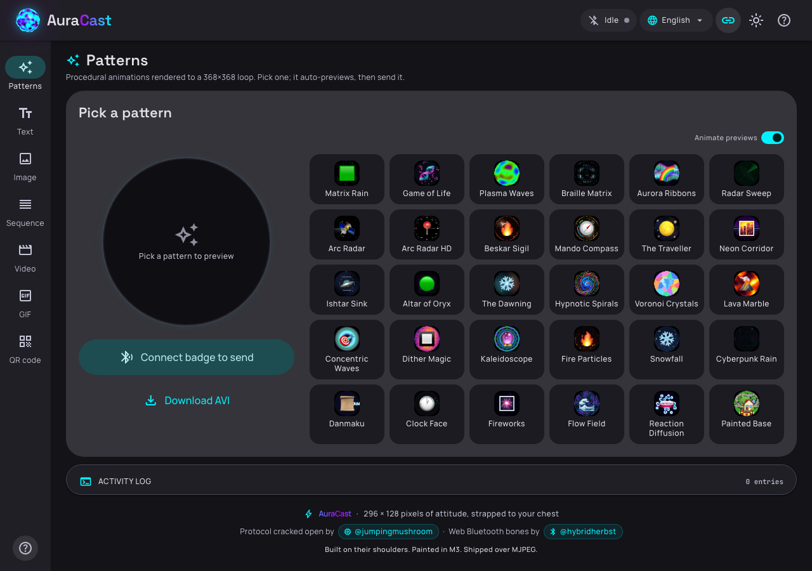
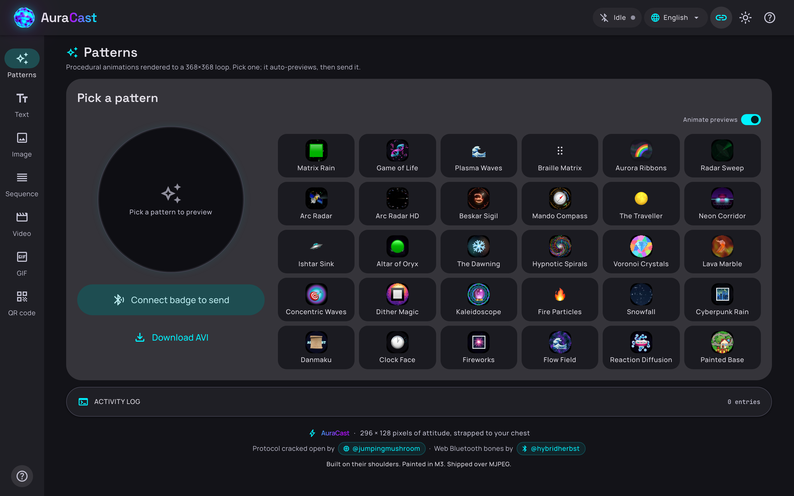
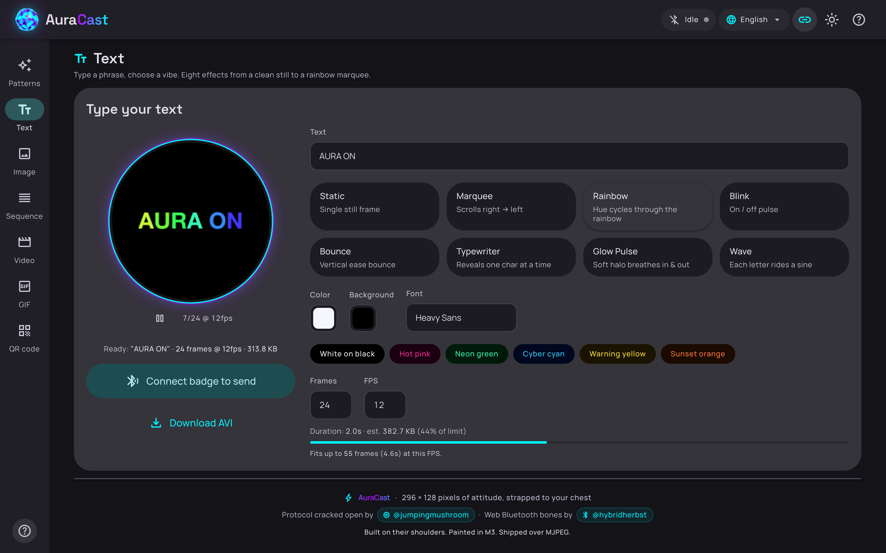
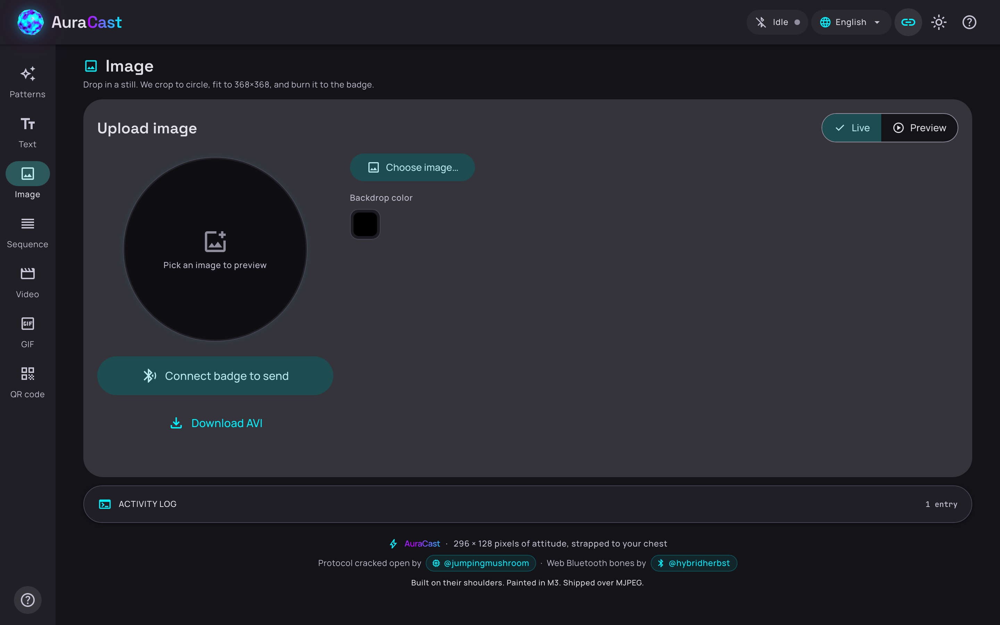
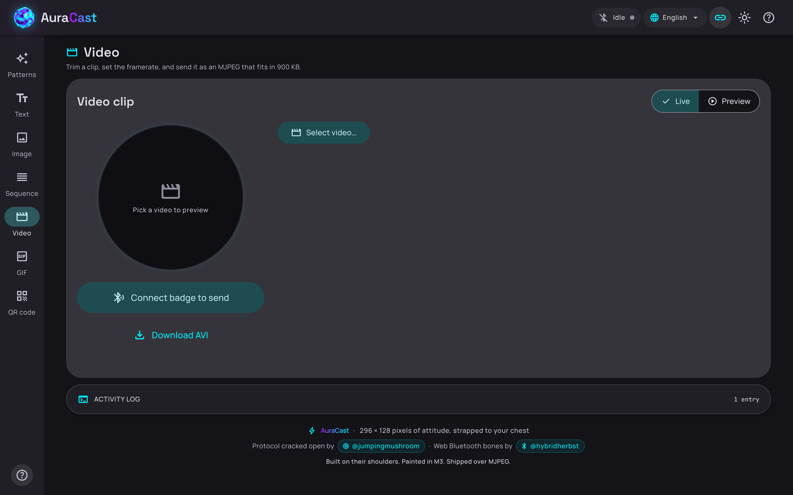
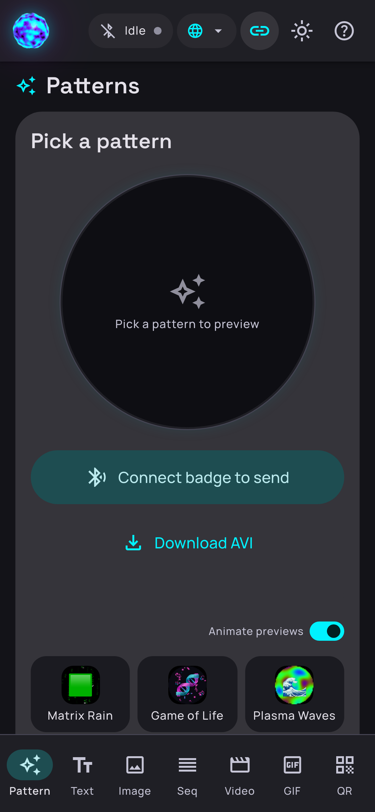

<div align="center">



# ✦ AuraCast

### The open-source web app for round LED smart badges

**Upload custom images, GIFs, animations, scrolling text, patterns, and QR codes — straight from your browser. No app store. No USB cable. No account.**

[](LICENSE)
[](https://svelte.dev)
[](#browser-support)
[](https://manaiakalani.github.io/auracast/)

</div>

---

> ### Just bought a round LED badge?
>
> The round LED smart badges sold on **Amazon**, **AliExpress**, **Temu**, and **TikTok Shop** as:
>
> **E87** · **E92** · **L8** · **X9** · **LED Smart Badge** · **Anime Smart Badge** · **Anime LED Pin** · **Aura Badge** · **DIY Light Up Pin** · **Wearable Display Pin** · **Round LED Name Tag** · **Smart LED Bluetooth Pin** · **Akinokai Display Pin** · **384x384 Round Pin** · **Programmable LED Badge** · **Custom Image Pin** · **Anime LED Lapel Pin** · **HiBadge** · **Bluetooth LED Pin** · **Round OLED Badge**
>
> ...all use the same Jieli BLE chip and speak the same protocol. If you have one of these, **AuraCast works with it.**
>
> The stock **Zrun** app (also shipped as "LED Badge", "HiBadge", "Badgy") is buggy, ad-filled, and barely works on iOS. AuraCast is the open-source replacement.

---

## Quick Start

1. **Press the side button** on your badge to wake it up
2. **Open AuraCast** in Chrome, Edge, Brave, Arc, or Opera — [launch it here](https://manaiakalani.github.io/auracast/)
3. **Click Connect** and pick your badge (`E87`, `E92`, `L8`, or `X9`) from the Bluetooth picker
4. **Drag in an image**, pick a pattern, type some text, or import a GIF — then click **Send**

That's it. The image appears on your badge in seconds.

> **iPhone / Safari / Firefox?** Those browsers cannot open Bluetooth themselves. The Python relay in [`relay/`](relay/README.md) runs on a computer that has a radio, and the phone uses that computer. The relay was checked against a simulated badge, not a physical one. See [Browser Support](#browser-support).

---

## Features

| | Feature | Details |
|---|---|---|
| ✨ | **30 animated patterns** | Matrix Rain, Aurora Ribbons, Fireworks, Clock Face, Flow Field, Reaction Diffusion, Painted Base, Voronoi Crystals, Kaleidoscope, Danmaku, and more. Generated in the browser as looping clips. |
| 🖼️ | **Image upload** | Drag-and-drop JPEG, PNG, or WebP. Auto-cropped and fitted to the badge's circular 368x368 display. |
| 🎞️ | **GIF import** | Drop an animated GIF — frames are decoded, circular-cropped, and packed as a looping MJPEG animation on the badge. |
| 🔤 | **Text effects** | Static, marquee, rainbow, blink, bounce, typewriter, glow, and wave. Custom colors and fonts. |
| 🎬 | **Video clips** | Trim MP4/MOV clips to fit the badge's 900 KB storage. Frame-by-frame preview before sending. |
| 📱 | **QR codes** | High-contrast circular QR codes that scan right off the badge. |
| 🖼️ | **Image sequences** | Multi-frame slideshows that loop on-device. |
| 🔋 | **Battery + charging** | Live battery percentage with charging state indicator. |
| 🔆 | **Brightness control** | Adjust badge screen brightness via slider. |
| 🩺 | **Diagnostics** | One-click connection probe for troubleshooting. |
| 🌗 | **Material 3 design** | Dark/light theme with M3 Expressive design tokens. |
| 📲 | **PWA install** | Home-screen install from Chromium on HTTPS. The relay's plain HTTP address on a phone can skip the service worker. The page still runs. |
| 🔒 | **Fully private** | Zero analytics. Zero cookies. Zero tracking. Zero network requests beyond your own badge. |

<div align="center">
<table>
<tr>
<td align="center"></td>
<td align="center"></td>
</tr>
<tr>
<td align="center">Pattern mode — 30 animated loops</td>
<td align="center">Text mode: marquee, rainbow, typewriter</td>
</tr>
<tr>
<td align="center"></td>
<td align="center"></td>
</tr>
<tr>
<td align="center">Image upload with circular crop</td>
<td align="center">Video clip trimmer</td>
</tr>
</table>
</div>

<details>
<summary><strong>Mobile UI</strong></summary>
<br/>
<div align="center">

</div>
</details>

---

## Is My Badge Supported?

If your badge is:
- **Round** (35-45 mm diameter)
- Connects via **Bluetooth Low Energy** (advertises as `E87`, `E92`, `L8`, `X9`, or `LED Badge`)
- Came with the **Zrun** / **HiBadge** / **LED Badge** app
- Has a **full-color OLED/LCD display** (not a monochrome scrolling text badge)

...it almost certainly works. All these listings use the same **Jieli BR23** chipset. Some listings say 384x384. AuraCast writes a 368x368 circle, which is the size this firmware displays.

> **Not supported:** Square and rectangular scrolling-text badges (the old note cited 64x16 and 32x8 panels) use a different protocol. AuraCast does not speak it. The badge_magic repository this page used to link is gone, and there is no maintained project that clearly covers those two sizes. The closest living tools are for a different family, 11x44 and 12x48 LED name badges: [led-name-badge-ls32](https://github.com/fossasia/led-name-badge-ls32) and [Badge Magic](https://github.com/fossasia/badgemagic-app). They do not drive E87, E92, L8, or X9 round badges. Do not flash that firmware onto a round badge.

---

## Browser Support

| Browser | Platform | Method |
|---|---|---|
| Chrome / Edge / Brave / Arc / Opera | Windows, macOS, Linux, Android, ChromeOS | Direct Web Bluetooth |
| Safari | macOS, iOS, iPadOS | Python relay on a computer with Bluetooth |
| Firefox | All | Python relay on a computer with Bluetooth |
| Chrome on iOS | iOS | Python relay (iOS Chrome is WebKit; the phone uses the computer's radio) |

### Browsers without Web Bluetooth

Safari, Firefox, and iOS Chrome cannot open a Bluetooth connection to the badge. [`relay/`](relay/README.md) is a small Python bridge for those browsers:

1. On a computer with Bluetooth: `cd relay && python3 -m pip install -r requirements.txt && python3 -m auracast_relay`
2. For an iPhone, add `--lan` and open the Wi-Fi address the relay prints. The phone does not talk to the badge. The computer's radio does. `--lan` has no password, so use a network you trust. That address is plain HTTP, so iOS may not install the service worker. Add to Home Screen from a Chromium browser on HTTPS when you want the installed app. The relay page itself still loads.
3. `cd web && npm run build` once so the relay can serve `web/dist`. On the same Mac, `npm run dev` proxies `/api` to `127.0.0.1:8787`. Restart the dev server if it was already running when that proxy was added.

The page calls `GET /api/status`, `POST /api/blob`, `POST /api/cancel`, `GET /api/diagnostics`, and `POST /api/cache/bust`. The upload state machine was checked against a simulated badge. It has not been tried on a physical badge. Chrome, Edge, Brave, Arc, and Opera on desktop or Android still connect directly and do not need the relay.

---

## Development

```bash
# Clone
git clone https://github.com/Manaiakalani/auracast.git
cd auracast/web

# Install
npm install

# Dev server (HTTPS required for Web Bluetooth)
npm run dev

# Production build
npm run build
```

### Python relay (Safari, Firefox, iPhone)

```bash
# The block above leaves you in web/. Step back to the relay.
cd ../relay
python3 -m pip install -r requirements.txt
python3 -m unittest discover -s tests -v   # simulated badge, no radio
python3 -m auracast_relay                  # or --lan for a phone
```

Build `web/dist` first if you want the relay to serve the app. See [relay/README.md](relay/README.md). The unittest command talks to a simulated badge. A physical badge has not been used.

### Project Structure

```
auracast/
├── README.md                ← You are here
├── PROTOCOL.md              ← Full BLE protocol reverse-engineering
├── DESIGN.md                ← Brand + design system spec
├── LICENSE                  ← MIT License
├── relay/                   ← Python BLE bridge for Safari, Firefox, iPhone
├── web/                     ← Svelte 5 web app
│   ├── src/
│   │   ├── App.svelte               Main app shell
│   │   ├── lib/                     Components, protocol, modes
│   │   ├── patterns/                30 procedural pattern generators
│   │   └── ...
│   └── README.md                    Web-specific build details
├── protocol-understanding/  ← Raw BLE captures + analysis
└── docs/screenshots/        ← App screenshots
```

---

## Why Not Just Use the Zrun App?

| Zrun pain point | AuraCast |
|---|---|
| iOS Bluetooth permissions fail silently | Web Bluetooth in Chromium, or the Python relay for Safari and iPhone |
| Crashes on uploads over ~200 KB | Streaming uploader with retries, tested to 900 KB |
| Fills flash storage, refuses new uploads | Clips are fitted under 900 KB. Clear the gallery in Zrun if older files fill it. |
| Locked to whichever app the seller bundled | One app for every rebrand of the same chipset |
| Ads, account signup, telemetry | Zero ads, zero tracking, zero accounts, fully local |
| Closed source | MIT-licensed, fully auditable, PRs welcome |

---

## Protocol Documentation

The complete BLE protocol reverse-engineering — every byte of the FE/DC/BA framing, Jieli RCSP authentication handshake, file metadata, windowed data transfer, CRC, and capture format — lives in **[PROTOCOL.md](./PROTOCOL.md)**.

---

## Credits

<table>
<tr>
<td align="center" width="50%">
  <strong>Protocol cracked open by</strong><br/><br/>
  <a href="https://github.com/jumpingmushroom"></a><br/>
  <a href="https://github.com/jumpingmushroom"><strong>@jumpingmushroom</strong></a><br/>
  <sub>Python e87_badge library, protocol analysis, GIF support, Home Assistant integration</sub>
</td>
<td align="center" width="50%">
  <strong>Web Bluetooth bones by</strong><br/><br/>
  <a href="https://github.com/hybridherbst"></a><br/>
  <a href="https://github.com/hybridherbst"><strong>@hybridherbst</strong></a><br/>
  <sub>Original web uploader, BLE reverse-engineering, Jieli RCSP auth, MJPEG streaming</sub>
</td>
</tr>
</table>

Built on their shoulders. Painted in Material 3. Shipped over MJPEG.

---

## License

[MIT](./LICENSE) — use it however you want.

---

<div align="center">

**[AuraCast](https://manaiakalani.github.io/auracast/)** — the open badge uploader

<sub>
Keywords: E87 smart badge · E92 smart badge · L8 LED badge · X9 LED pin · round LED badge · anime badge app · LED smart pin · Zrun alternative · Zrun replacement · HiBadge alternative · Web Bluetooth badge · BLE LED badge · programmable LED pin · round OLED badge · anime LED lapel pin · Akinokai badge · Jieli badge · custom badge uploader · AuraCast
</sub>

</div>
